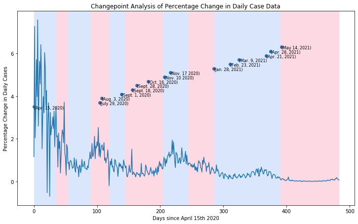

## 512 Project

This repository is for the final project of DATA 512 for Fall 2022. 

## Part 1 Analysis
Part one analysis can be found in part1.ipynb. The data comes from 3 different sources 
    - [Johns Hopkins University COVID-19 Data](https://www.kaggle.com/datasets/antgoldbloom/covid19-data-from-john-hopkins-university)
    - [masking mandatas by county](https://data.cdc.gov/Policy-Surveillance/U-S-State-and-Territorial-Public-Mask-Mandates-Fro/62d6-pm5i)
    - [masking compliance survey](https://github.com/nytimes/covid-19-data/tree/master/mask-use)

The county in question is Baltimore county, Maryland. The goal of this analysis is to see how masking policy and adherence impacts the spread of COVID-19. To explore this question I analyzed case data as well as policy data to see if there were any timepoints of interest in the time series data that aligned with policy changes.

## Part 1 Results

This graph shows the results from using the Pelt changepoint algorithm on percentage change in daily case data. Overlaid are the dates of all of the policy changes that Baltimore county instated. The red regions are candidates for changepoints in the timeseries. Using these three, I was able to identify a couple of specific policies that  were of interest with respect to percentage change in daily cases.

## Part 2 Extension
Part 2 of the analysis brought in data from the Baltimore Police Departments call log data which can be fount at:
- [2020 Police Department Calls](https://data.baltimorecity.gov/datasets/911-calls-for-service-2020/explore)
- [2021 Police Department Calls](https://data.baltimorecity.gov/datasets/911-calls-for-service-2021/explore) 

These tables included data about the call date and time, the reason for the call, the priority of response, as well as the location where help was needed.

I attempted to see if there was any causal relationship between high priority calls related to shootings and the percentage change in daily covid cases. Also I tried to go deeper into the policies to see if there was any evidence to suggest that they impacted the daily changes in cases. 

Below is the graph of the high priority calls as well as the daily percentage change in COVID cases. As you can see there, other than the outlier period, there seems to be an inverse relationship between the two time series suggesting that they might be related. 

Using a library for cross convergent mapping called [skccm](https://skccm.readthedocs.io/en/latest/), I tested for the Granger Causality of the two time series. First I tested for just high priority calls, and then just for calls related to shootings. Both tests were not significant enough to assume that the two time series were causally related. When looking back in the original data, there was a period of a couple of months with significantly higher call volume. This seemed to be the culprit for throwing off the model so I looked for ways to identify this spike to see if there was any way around it. Checking various local news sources, as well as homocide data for the quarter, I could not identyfy anything out of the ordinary. 

Below is a plot showing the result of the CCM model. Along the x axis is the library length, or the amount of training data that is used in the model, and the y axis is the correlation of the predictions of the model. We should expect that as more and more information is given to the model that correlation will increase and both time series will converge, however this wasnt the case.

## Part 3 Presentation
Attatched is the [link](https://docs.google.com/presentation/d/15Td424jAE6HmExu6K4DU7Rxqul2MqT-bxlhsKYcM9WA/edit?usp=sharing) to the presentation associated with this project.